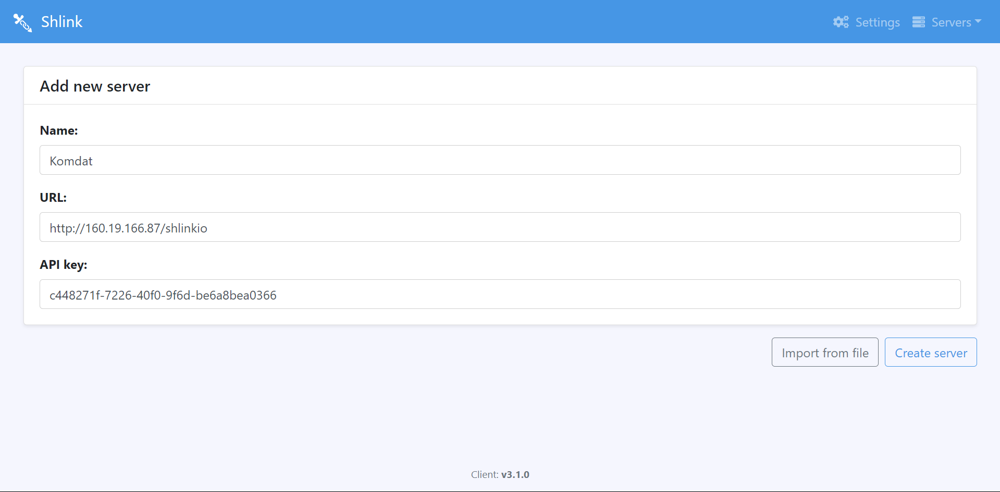

<h1 align="center"></h1>

[Sekilas Tentang](#sekilas-tentang) | [Instalasi](#instalasi) | [Konfigurasi](#konfigurasi) | [Otomatisasi](#otomatisasi) | [Cara Pemakaian](#cara-pemakaian) | [Pembahasan](#pembahasan) | [Referensi](#referensi)
:---:|:---:|:---:|:---:|:---:|:---:|:---:


# Sekilas Tentang

Shlink adalah pemendek URL self-hosted yang memberikan fleksibilitas tinggi dengan menyediakan antarmuka REST dan CLI untuk berinteraksi dengan sistem. Ini memungkinkan pengguna untuk membuat dan mengelola URL pendek secara langsung melalui command line atau API, menjadikannya pilihan yang ideal untuk mereka yang ingin mengotomatisasi proses pemendekan URL atau mengintegrasikannya dengan aplikasi lain. Untuk memberikan pengalaman yang lebih mudah dan ramah pengguna, tersedia juga *Shlink Web Client*—antarmuka web resmi yang memanfaatkan API REST Shlink, memungkinkan pengelolaan beberapa instance Shlink melalui UI yang sederhana namun fungsional.

Dokumentasi Shlink memberikan panduan lengkap tentang cara menginstal dan mengonfigurasi baik aplikasi inti maupun klien web dengan beberapa metode instalasi yang tersedia. Selain instalasi, dokumentasi tersebut menjelaskan struktur arsitektur Shlink, fitur yang dapat dimanfaatkan setelah sistem berjalan, dan cara menangani instance multi-domain. Pengguna juga dapat menemukan jawaban atas pertanyaan umum yang membantu mengoptimalkan penggunaan Shlink dan mengatasi kendala umum yang mungkin dihadapi.

# Instalasi

#### Kebutuhan Sistem :
- Unix, Linux atau Windows.
- Apache Web server.
- PHP 8.2.
- MariaDB
- VPS 

#### Proses Instalasi :
1. Login kedalam server menggunakan SSH. Untuk pengguna windows bisa menggunakan Virtual Machine berbasis Linux
    ```
    $ ssh root@160.19.166.87
    ```

2. Pastikan seluruh paket sistem kita *up-to-date*, dan install seluruh kebutuhan sisrem seperti `Apache`, `PHP`, `MySQL` dan `MariaDB`.
    ```
    $ sudo apt update
    $ sudo apt upgrade -y
    $ sudo apt install lsb-release apt-transport-https ca-certificates unzip -y
    $ sudo wget -O /etc/apt/trusted.gpg.d/php.gpg https://packages.sury.org/php/apt.gpg
    $ echo "deb https://packages.sury.org/php/ $(lsb_release -sc) main" | sudo tee /etc/apt/sources.list.d/php.list
    $ sudo apt update
    $ sudo apt-get install apache2 mariadb-server mariadb-client -y
    $ sudo apt install php8.0 libapache2-mod-php8.0 php8.0-curl php8.0-intl php8.0-gd php8.0-pdo php8.0-fpm php8.0-common php8.0-mysql php8.0-xml php8.0-apcu -y
    $ sudo a2dismod mpm_prefork php8.0
    $ sudo a2enmod mpm_event rewrite proxy_fcgi setenvif php8.0
    $ sudo a2enconf php8.0-fpm
    $ sudo su
    $ mysql_secure_installation
    ```
2. Buat database untuk **Shlinkio**
    ```
    $ mysql -u root -p
    $ CREATE DATABASE shlinkio;
    $ GRANT ALL ON shlinkio.* to 'shlinkio_rw'@'localhost' IDENTIFIED BY '$hlink10!';
    $ FLUSH PRIVILEGES;
    $ EXIT;
    $ exit
    ```

3. Unduh **Shlinkio** ke dalam direktori kita. 
    ```
    $ sudo wget https://github.com/shlinkio/shlink/releases/download/v2.6.2/shlink2.6.2_php8.0_dist.zip
    ```

4. Ekstrak file yang telah diunduh ke dalam direktori yang kita inginkan.
    ```
    $ sudo unzip shlink2.6.2_php8.0_dist.zip -d /var/www
    $ sudo mv /var/www/shlink* /var/www/shlinkio
    ```

5. Ubah otorisasi kepemilikan ke user www-data (webserver)
    ```
    $ sudo chown -R www-data:www-data /var/www/shlinkio
    ```

6. Jalankan installer shlinkioo
    ```
    $ sudo -u www-data php /var/www/shlinkio/bin/install
    ```

7. Konfigurasi Apache web server.
    ```
    $ sudo wget https://github.com/shlinkio/shlink-web-client/releases/download/v3.1.0/shlink-web-client_3.1.0_dist.zip
    $ sudo unzip shlink-web-client_3.1.0_dist.zip
    $ sudo mv ./shlink-web-client*/* /var/www/html
    $ sudo nano /etc/apache2/sites-available/shlinkio.conf

    Alias /shlinkio "/var/www/shlinkio/public/"
    <Directory /var/www/shlinkio/public>
    Options FollowSymlinks Includes ExecCGI
    AllowOverride All
    Require all granted
    Order allow,deny
    allow from all
    </Directory>
    ```
8. Jalankan site shlinkio
   ```
   $ sudo a2ensite shlinkio
   ```
9. Restart kembali Apache web server.
    ```
    $ sudo systemctl restart apache2
    ```
10. Generate API key
    ```
    $ sudo -u www-data php /var/www/shlinkio/bin/cli api-key:generate
    ```

11. Kunjungi alamat IP web server
    - Kunjungi alamat domain

      

    - Pilih add your first server

      

    - Isi name sesuai keinginan

    - Isi URL dengan http://(alamat IP)/shlinkio

    - Isi API Key dengan API yang didapat dari generate API key

      


12. Proses instalasi selesai
    


# Cara Pemakaian

isi cara pemakaian


# Pembahasan

Shlink merupakan solusi pemendek URL yang menarik untuk pengguna yang menginginkan kendali penuh atas data dan infrastruktur.Aplikasi ini mencerminkan tren penting dalam dunia teknologi web, di mana privasi data, transparansi, dan fleksibilitas menjadi semakin diutamakan. 

Sebagai aplikasi open-source dan self-hosted, Shlink memberikan alternatif yang menarik bagi layanan pemendek URL komersial. ini sangat membantu untuk organisasi atau individu yang memiliki kebutuhan spesifik dalam manajemen URL yang ingin menghindari ketergantungan pada pihak ketiga.

Kelebihan: 
Aplikasi ini menawarkan sejumlah keunggulan di antaranya:
- Kontrol penuh: Pengguna memiliki kendali penuh atas seluruh data dan infrastruktur mereka sendiri, sehingga pengguna dapat menyesuaikan sistem sesuai kebutuhan tanpa ada keterlibatan pihak ketiga.
- Privasi dan keamanan: Dengan sistem self-hosted, data pengguna tidak dibagikan dengan pihak ketiga, sehingga memberikan tingkat privasi dan keamanan yang lebih tinggi dibandingkan dengan layanan berbasis cloud.
- Kustomisasi: Aplikasi ini sangat fleksibel dan dapat disesuaikan sesuai kebutuhan pengguna, baik dalam hal fitur, tampilan, maupun pengaturan sistem.
- Fitur lengkap: Shlinkio menyediakan berbagai fitur seperti analitik mendalam, API, manajemen multi-domain, dan banyak lagi, menjadikannya solusi yang komprehensif untuk manajemen URL
- Gratis dan open-source: Aplikasi ini dapat digunakan tanpa biaya lisensi karena merupakan software open-source. Kode sumbernya dapat diakses, diaudit, dan dimodifikasi oleh siapa saja.
- Integrasi: Shlinkio memiliki API yang kuat, memungkinkan integrasi yang lancar dengan sistem lain, memudahkan pengguna untuk menghubungkan aplikasi ini dengan platform lain sesuai kebutuhan.

Kekurangan: 
Tentu saja setiap aplikasi memiliki kekurangan berikut beberapa kekurangan dari Shlinkio antara lain:
- Kompleksitas teknis:Pengguna yang ingin menggunakan aplikasi ini harus memiliki pengetahuan teknis yang memadai, terutama dalam hal instalasi, konfigurasi, dan pemeliharaan sistem.
- Tanggung jawab infrastruktur: Karena bersifat self-hosted, pengguna bertanggung jawab penuh atas pengelolaan hosting, keamanan, dan pembaruan sistem, yang memerlukan sumber daya dan waktu tambahan.
- Dukungan terbatas: Berbeda dengan layanan komersial yang menyediakan dukungan 24/7, Shlinkio tidak memiliki dukungan profesional secara langsung, sehingga pengguna harus bergantung pada komunitas dan dokumentasi.
- Potensi biaya tersembunyi: Meskipun aplikasi ini gratis, pengguna masih perlu menyiapkan biaya untuk hosting dan pemeliharaan server yang diperlukan untuk menjalankannya.
- Kurva pembelajaran: Aplikasi ini memiliki banyak fitur yang membutuhkan waktu untuk dipelajari. Pengguna mungkin memerlukan waktu lebih lama untuk menguasai seluruh fungsionalitas yang ditawarkan.


# Referensi

1. [Self-hosted URL Shortener with Shlink](https://i12bretro.github.io/tutorials/0225.html) - Github
